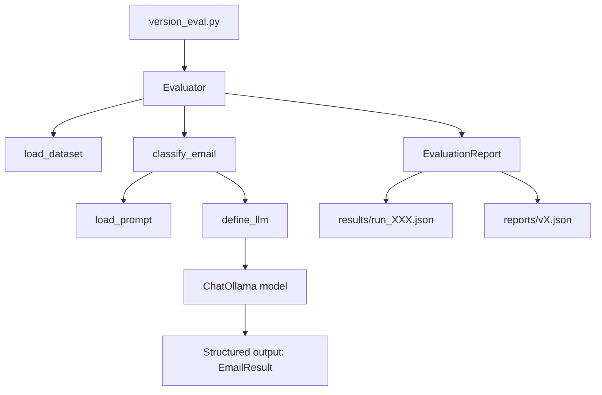

# LLM Regression Detector

## Overview

This repository implements an experiment for evaluating prompt versions and regression behavior in a customer support email classifier built with an LLM.

The experiment uses a golden dataset of labeled emails and checks whether the LLM correctly predicts each email's category and summary. Results are saved as both a prompt-version summary report and a full evaluation run report.

## What this experiment measures

- `accuracy`: percent of emails classified correctly by category
- `passed_cases`: number of samples where predicted category matched expected category
- `failed_cases`: number of mismatches
- `latency_ms`: how long each classification request took

It is designed to compare prompt versions (`v1`, `v2`, `v3`, etc.) and detect regressions in model output when the prompt logic changes.

## How it works

1. `version_eval.py` starts the evaluation for a specific prompt version.
2. `app.evaluate.Evaluator` loads the golden dataset from `dataset/golden_dataset_v1.json`.
3. For each email sample, it calls `app.classifier.classify_email(...)`.
4. The classifier loads the prompt config from `prompts/{version}.yaml`.
5. The LLM is initialized via `app.llm.define_llm()` using `ChatOllama`.
6. The email text is combined with the system prompt and passed to the LLM.
7. The LLM returns structured output that includes:
   - `category`
   - `summary`
8. Evaluation compares predicted category against expected category and records pass/fail.
9. A summary report and a detailed run file are saved.

## Architecture



## Directories

- `app/`: application logic and evaluation pipeline
- `dataset/`: golden dataset of labeled customer emails
- `prompts/`: prompt versions for the LLM
- `reports/`: prompt-version summary reports
- `results/`: detailed evaluation run results

## Running the experiment

1. Create and activate a Python environment:

```powershell
python -m venv .venv
.\.venv\Scripts\activate
```

2. Install dependencies:

```powershell
pip install -r requirements.txt
```

3. Run the evaluation:

```powershell
python version_eval.py
```

4. Check the output:
   - summary printed to console
   - detailed run saved to `results/run_###.json`
   - prompt-version summary saved to `reports/vX.json`

## Expected output

- Console summary with prompt version, accuracy, passed cases, and failed cases.
- `reports/vX.json`: top-level evaluation summary for the prompt version.
- `results/run_XXX.json`: complete evaluation report including per-sample predictions, summaries, pass/fail status, and latency.

## Final report

The final report is produced in two places:

- `reports/{prompt_version}.json`: stores the overall score for each prompt version.
- `results/run_###.json`: stores the full evaluation details for one execution.

This enables both quick comparison across prompt versions and deep analysis of individual cases.

## Notes

- The current model is configured in `app/config.py`.
- The prompt text is stored in YAML files under `prompts/`.
- The dataset is stored in JSON format under `dataset/`.
- The evaluation is intentionally rate-limited with `time.sleep(10)` between calls.
